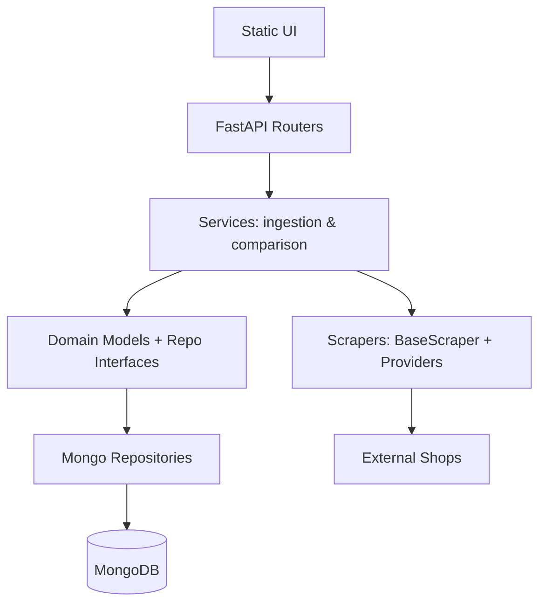

# Architecture

## Goals
- Separate responsibilities across layers to keep scraping, business rules, and persistence decoupled.
- Make it easy to add new shops or categories without changing core services.
- Keep the system testable by isolating domain logic from infrastructure details.
- Support historical price tracking and comparison queries efficiently.

## Architectural Style
- Layered architecture with service-oriented boundaries:
  - API layer exposes REST endpoints.
  - Services orchestrate use cases.
  - Domain layer holds models and repository contracts.
  - Infrastructure provides MongoDB implementations.
  - Scraping layer pulls data from external shops.
  - Static UI consumes the API.

## Layers and Responsibilities

### API Layer (FastAPI)
- Entry points for client requests and DTO mapping.
- Files: `app/api/products.py`, `app/api/compare.py`, `app/api/prices.py`, `app/api/shops.py`.

### Service Layer
- Orchestrates ingestion and comparison use cases.
- Files: `app/services/ingestion_service.py`, `app/services/compare_service.py`, `app/services/ingest.py`.

### Domain Layer
- Core entities, enums, and repository interfaces.
- Files: `app/domain/models.py`, `app/domain/enums.py`, `app/domain/repositories.py`.

### Infrastructure Layer (MongoDB)
- Concrete repository implementations and DB connection setup.
- Files: `app/infrastructure/mongo/connection.py`, `app/infrastructure/mongo/repositories.py`.

### Scraping Layer
- Template Method base class + providers per shop.
- Files: `app/services/scraping/base.py`, `app/services/scraping/factory.py`, `app/services/providers/*.py`.

### Frontend (Static UI)
- Simple UI that consumes REST endpoints.
- Files: `app/static/pages/*.js`, `app/static/styles.css` (HTML shell rendered in `app/main.py`).

### Configuration and Runtime
- Environment config and entrypoints.
- Files: `app/config.py`, `.env`, `app/main.py`, `scripts/manual_ingest.py`.

## Data Model
- Products: canonical `sku`, name, brand, category, and images.
- Shops: stable shop code and display name.
- Prices: immutable time-series entries with `product_sku`, `store_code`, price, currency, timestamp.
- MongoDB indexes on `(product_sku, store_code, timestamp)` enable fast latest-price and history queries.

## Data Flow
1. Scrapers fetch HTML from shops and yield `ScrapedItem` objects.
2. `IngestionService` normalizes items into domain `Product` and `PricePoint`.
3. Repositories persist products, shops, and price history in MongoDB.
4. API endpoints read from repositories to serve product lists, compare results, and history.
5. Static UI calls the API and renders comparisons.

## Design Patterns (Evidence)
- Template Method: `BaseScraper.fetch()` defines the invariant scrape workflow.
- Factory: `ScraperFactory` creates scrapers by `ShopName`.
- Repository: domain contracts + Mongo implementations.
- Singleton/cached dependencies: Mongo connection and dependency providers.

## Advanced Aspect Mapping
- 3.2 Client-server / service-oriented: UI + REST API + MongoDB with clear separation.
- 3.3 Data-intensive: time-series price history and aggregation queries in MongoDB.

## Error Handling and Robustness
- Scraper fetch wraps requests in try/except to avoid pipeline failures.
- Ingestion wraps scraper runs to keep one failing shop from blocking others.
- API returns explicit 404s for missing products.

## Extensibility
- Add a new shop by implementing a provider in `app/services/providers/` and registering it in `ScraperFactory`.
- Add new endpoints without touching domain or infrastructure contracts.
- Extend product schema with new fields while keeping MongoDB flexible.

## Non-Functional Considerations
- Performance: MongoDB indexes, limited pagination, deduped URLs.
- Scalability: ingestion can be moved to a worker or scheduler.
- Security: env-based config, no hard-coded secrets in code.
- Ethics: respectful scraping and bounded pagination.

## Testing
- Unit tests for price parsing and comparison logic in `tests/`.
- Recommended: add scraper fixtures and API integration tests.

## Tools and Practices
- Version control via Git.
- Automated tests with `pytest`.
- CI workflow in `.github/workflows/tests.yml`.

## Diagram (Mermaid)


## Diagram (ASCII)
```
[UI] -> [FastAPI Routers] -> [Services] -> [Domain Models]
                          |               |
                          v               v
                    [Scrapers]        [Mongo Repos] -> [MongoDB]
                          |
                          v
                     [External Shops]
```
